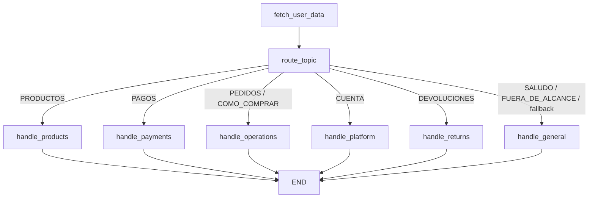

# Agent Architecture Design

## 1. Overview
The assistant uses a **stateful LangGraph architecture** that separates concerns across a router and specialized domain agents. Instead of a single generic responder, the system routes each user request to the most appropriate handler using business-aware guardrails plus LLM classification. This design prioritizes response quality, policy compliance, and multi-turn continuity for critical flows like returns/refunds.

Current high-level flow:

`fetch_user_data -> route_topic -> specialized handler -> END`

---

## 2. Agent Design

| Agent Name | Topics Handled | Rationale |
|-----------|----------------|-----------|
| `handle_general` | `SALUDO`, `FUERA_DE_ALCANCE` (safe fallback) | Keeps lightweight generic coverage for greetings and non-business requests while preserving graceful fallback behavior. |
| `handle_products` | `PRODUCTOS` | Isolates recommendation and promotion logic (catalog candidates, budget-aware suggestions, competitor-comparison guardrails). |
| `handle_payments` | `PAGOS` | Concentrates installment rules, amount/month parsing, debt summaries, and payment-security constraints. |
| `handle_operations` | `PEDIDOS`, `COMO_COMPRAR` | Centralizes order lifecycle and operational guidance (status tracking, delivery timing, purchase flow). |
| `handle_platform` | `CUENTA` | Covers account/app support, auth-security behaviors, and self-service vs support-required actions. |
| `handle_returns` | `DEVOLUCIONES` | Implements deterministic multi-step return/refund orchestration with state continuity and eligibility validations. |
| `route_topic` | Routing node | Produces `selected_topic`, `selected_agent`, and `router_reasoning`; applies hybrid deterministic + LLM routing. |

---

## 3. Flow Diagram

---

## 4. State Design and Invariants

The architecture keeps a shared `GraphState` and each node returns partial updates. The most relevant runtime state fields are:

- Routing fields: `selected_topic`, `selected_agent`, `router_reasoning`
- Returns continuity: `current_step`, `is_return_in_progress`
- Conversation context: `last_topic_selected`, `set_previous_selected_topics`, `messages`
- User context: `user_data`, `user_data_summary`

Key invariants enforced by design:

- `selected_topic` and `selected_agent` must always be present after routing.
- `generation` must always be non-empty, even under chain failures.
- Returns flow must preserve/restore continuity (`current_step` + `is_return_in_progress`) across turns and fallback paths.

---

## 5. Router Strategy (Hybrid Deterministic + LLM)

`route_topic` uses a layered strategy:

1. **Guardrail overrides first** for safety-sensitive intents:
   - Sensitive payment data
   - Authentication secrets
   - Competitor comparison
   - Obviously out-of-scope prompts
2. **Keyword overrides** for high-confidence intents (payments, account, returns, operations).
3. **LLM router chain** for remaining ambiguous requests.
4. **Hard fallback** to `FUERA_DE_ALCANCE` + `handle_general` if chain processing fails.
5. **KB consistency enforcement**: final agent is aligned with `responsible_agent` in the KB to avoid drift.

This hybrid approach reduces misrouting on critical intents while preserving flexibility for natural language variability.

---

## 6. Knowledge Base Integration

The KB is topic-structured and includes:

- `responsible_agent`
- topic context and instructions
- curated scenarios and edge cases
- topic-specific user-data variables

Handlers consume topic metadata from the KB and filter user context accordingly, producing responses that are more concrete and policy-aligned than a generic all-in-one prompt.

---

## 7. Multi-step Returns Flow

`handle_returns` is a dedicated orchestration node with deterministic validations and optional LLM polishing.

### Step model

- `returns_step_1_collect_order`
- `returns_step_1_collect_reason`

### Core logic

1. Start return flow and request order ID if missing.
2. Validate order existence and ownership.
3. Validate eligibility:
   - Delivered status
   - 15-day return window
   - non-returnable product categories
4. If eligible, collect reason and confirm request.
5. Return final operational guidance (pickup and refund timeline).

### Escalation logic

Immediate escalation patterns include damaged/wrong product and non-delivery-like incidents. In those cases, deterministic escalation text is prioritized.

### Continuity behavior

The node infers/maintains step continuity from state + recent conversation context, enabling short follow-ups (e.g., reason option `1..5`) without restarting the process.

---

## 8. Guardrails and Policy Controls

Cross-cutting deterministic guardrails are used in router and handlers to prevent unsafe behavior:

- Never request/echo OTP, password, PIN, full card/CVV data.
- Refuse competitor price comparison requests.
- Detect and redirect out-of-scope topics.
- Avoid hallucinating unavailable business data by grounding responses in filtered user data + KB context.

This deterministic layer protects policy compliance before/alongside LLM generation.

---

## 9. Stability and Error Hardening

The architecture includes runtime hardening so conversation quality degrades gracefully under failures:

- Safe parsing helpers for chain outputs (`safe_chain` utilities).
- Structured output normalization before use in state updates.
- Per-node chain try/catch with deterministic fallback responses.
- Compact error logging with safe context for debugging.

Result: no node should crash the user flow; state remains coherent even when a chain call fails.

---

## 10. Key Design Decisions and Trade-offs

### Decision A: Specialized agents instead of one general node

- **Benefit:** Better domain precision, clearer prompts, and easier targeted testing.
- **Trade-off:** More files and orchestration complexity.

### Decision B: Hybrid routing (deterministic + LLM)

- **Benefit:** Higher reliability on critical intents, lower policy risk.
- **Trade-off:** More routing logic to maintain than pure LLM classification.

### Decision C: Deterministic returns core + LLM phrasing layer

- **Benefit:** Business constraints remain enforceable while responses stay natural.
- **Trade-off:** Some conversational flexibility is intentionally constrained.

### Decision D: Defensive fallbacks everywhere

- **Benefit:** Better production resilience and safer user experience under partial outages/errors.
- **Trade-off:** Additional implementation and test surface.

---

## 11. Limitations and Next Evolution

Current limitations:

- The KB is code-based; non-technical teams still depend on engineering deployment for updates.
- Router quality monitoring is not yet connected to production observability tooling.
- Some temporal values in mock data are static/historical by design.

Recommended next steps:

1. Externalize KB management (DB/CMS) with versioning.
2. Add online routing quality telemetry and drift alerts.
3. Expand automated evaluation datasets for long multi-turn regressions.
4. Add production-grade checkpoint persistence backend and tracing.

---

## 12. Implementation Mapping

Architecture described above maps directly to current implementation modules:

- Graph orchestration: `source/application/graph.py`
- Router: `source/domain/route_topic.py`
- Domain handlers: `source/domain/handle_*.py`
- Chains: `source/adapters/chains/*.py`
- KB + guardrails + formatting + safety helpers: `source/adapters/utils/*.py`
